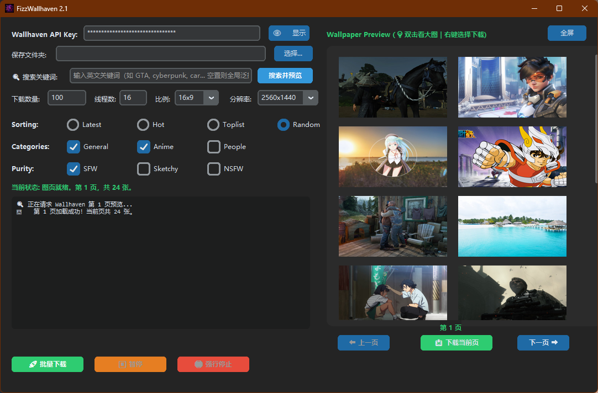

<div align="center">


# FizzWallhaven 2.1

### 一款面向 Windows 的现代化 Wallhaven 壁纸浏览与下载工具

<p>
  
  
  
  
  
</p>

<p>
  通过简洁的桌面界面搜索、预览、筛选并下载 Wallhaven 壁纸。
</p>

[English](README.md) | 简体中文

</div>

---

## 软件预览

<div align="center">



</div>

---
## 注意事项

- 国内网络环境下，访问 Wallhaven 及其图片资源通常需要配合 VPN 或其他可正常访问 Wallhaven 的网络环境使用。
- 下载速度会受到本地网络状况、Wallhaven 服务器状态和限流策略影响。
- 部分壁纸可能因被删除、权限限制或链接失效而无法下载。
- NSFW 内容需要 Wallhaven 账号具备相应权限。
- 程序目前主要面向 Windows 平台。
- 批量下载数量较大时，建议保持程序在前台运行，并避免频繁关闭窗口。
- 本地已经存在同名图片时，程序会自动跳过，不会重复下载。

---
## 主要功能

<table>
<tr>
<td width="50%" valign="top">

### 壁纸浏览

- 根据关键词搜索壁纸
- 分页显示壁纸缩略图
- 缩略图布局随窗口宽度自动调整
- 支持上一页和下一页切换
- 支持全屏浏览界面
- 双击缩略图打开原图

</td>
<td width="50%" valign="top">

### 灵活下载

- 右键下载单张壁纸
- 下载当前预览页
- 按指定数量批量下载
- 支持暂停和强行停止
- 自动跳过本地已存在的同名文件
- 自动重试临时失败的下载任务

</td>
</tr>
</table>

---

## 搜索筛选

FizzWallhaven 支持以下 Wallhaven 搜索条件：

| 筛选项 | 可选内容 |
|---|---|
| 排序方式 | Latest、Hot、Toplist、Random |
| 壁纸分类 | General、Anime、People |
| 纯净度 | SFW、Sketchy、NSFW |
| 画面比例 | 16:9、16:10、21:9、4:3、1:1、All |
| 最低分辨率 | All、1920×1080、2560×1440、3840×2160、5120×2880 |
| 搜索关键词 | 可留空，也可输入英文关键词 |

> NSFW 内容需要有效的 Wallhaven 账号、API Key，以及对应的账号访问权限。

---

## 下载机制

FizzWallhaven 使用两阶段下载策略：

1. 第一阶段采用多线程并发方式高速下载壁纸。
2. 遇到 HTTP `429`、网络波动或服务器临时错误的图片，会自动进入补偿队列。
3. 第一阶段完成后，程序自动继续补偿下载，不需要用户重新点击。
4. 本地已经存在同名且大小正常的文件时，会直接跳过，避免重复下载。

这种方式可以兼顾下载速度和完整性。

---

## 运行要求

- Windows 10 或 Windows 11
- Python 3.12 或更高版本
- 个人 Wallhaven API Key

---

## 安装方法

克隆仓库：

```bash
git clone https://github.com/Andyzsc/FizzWallhaven-Downloader.git
cd FizzWallhaven-Downloader
```

安装依赖：

```bash
python -m pip install -r requirements.txt
```

运行程序：

```bash
python FizzWallhaven2.1.py
```

---

## 快速使用

1. 启动 `FizzWallhaven2.1.py`。
2. 输入个人 Wallhaven API Key。
3. 选择壁纸保存文件夹。
4. 根据需要输入搜索关键词。
5. 选择排序、分类、纯净度、比例和最低分辨率。
6. 点击 **搜索并预览**。
7. 使用 **上一页** 和 **下一页** 浏览壁纸。
8. 双击缩略图可以在浏览器中打开原图。
9. 右键缩略图可以下载单张壁纸。
10. 点击 **下载当前页** 可以保存当前页面的所有壁纸。
11. 设置下载数量后，点击 **批量下载** 可以自动跨页下载指定数量的壁纸。

---

## 鼠标与键盘操作

| 操作 | 使用方式 |
|---|---|
| 打开原始壁纸 | 双击缩略图 |
| 下载单张壁纸 | 右键缩略图 |
| 进入或退出全屏 | 按下 `F11` |
| 退出全屏 | 按下 `Esc` |
| 暂停或继续下载 | 按下 `Space`，或点击暂停按钮 |

---

## Wallhaven API Key

FizzWallhaven 需要用户自行提供 Wallhaven API Key。

API Key 会在首次输入后保存在本地文件：

```text
config.txt
```

安全说明：

- 源代码中没有写死任何个人 API Key。
- `config.txt` 已通过 `.gitignore` 排除。
- 请勿上传、提交或分享自己的 `config.txt`。
- 请勿将自己的 API Key 写入源代码或 README。

---

## 项目结构

```text
FizzWallhaven-Downloader/
├── assets/
│   ├── FizzWallhaven.ico
│   └── FizzWallhaven.png
├── screenshots/
│   └── main.png
├── .gitignore
├── FizzWallhaven2.1.py
├── README.md
├── README_CN.md
└── requirements.txt
```

---

## 项目依赖

```text
requests
customtkinter
Pillow
```

可通过以下命令一次性安装：

```bash
python -m pip install -r requirements.txt
```

---

---

## 后续计划

- [ ] 将当前单文件代码拆分为多个模块
- [ ] 发布可直接运行的 Windows EXE 版本
- [ ] 增加更详细的下载统计信息
- [ ] 继续优化缩略图缓存和内存管理
- [ ] 开发适合手机浏览的 FizzWallhaven Web App
- [ ] 增加收藏和浏览历史功能

---

## 安全说明

请勿将以下文件提交到公开仓库：

```text
config.txt
.env
.idea/
__pycache__/
build/
dist/
```

推荐的 `.gitignore` 已经包含这些内容。

---

## 开源许可

当前项目暂未添加开源许可证。

在正式添加许可证之前，项目源代码虽然可以公开查看，但不代表自动授权他人复制、修改或重新分发。

---

<div align="center">

### FizzWallhaven 2.1

使用 Python、CustomTkinter 和 Wallhaven API 构建。

</div>
